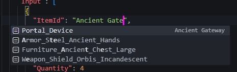
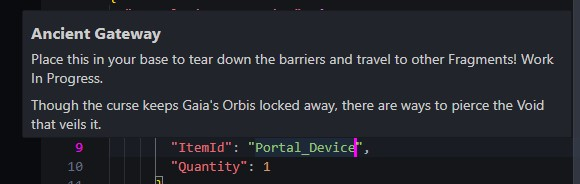
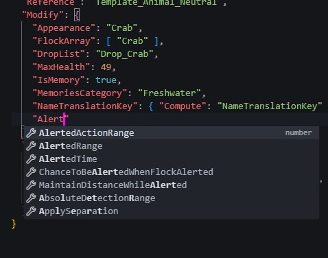
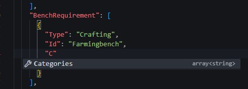

# VSCode Completions for Hytale

VSCode extension that provides completions for Hytale related things.

## Current features
- Autocomplete for Item names and/or IDs, with names matching into IDs
- Hover documentation for Item IDs, NPC Roles, and more, showing the in-game text where relevant
- Schemas for several .json files in Server/*

## Planned features
- Even more schemas for all .json file types (different schemas for all .json files in Server/*)
- Matching icons for each item

## Requirements
The extension is initialized in all projects that have a manifest.json file and a Server or Common folder anywhere in your project. Alternatively you can add an empty .hytale file in your project and it will initialize regardless.

